 # Criar Projeto Java EE + JSF + Primefaces + Maven
## Introdução
 > por: Roberto Danilo de Sousa Amoras às 20:20hs - 06/10/2019 - 22 anos, Desenvolvedor Junior, apaixonado por técnologias, entusiasta por querer aprender e inovar, e sim o futuro deste planeta vão pertencer às Skynets caso não tenhamos cuidados em conduzir e  treinar as inteligências artificiais.

 > por: [Igor Felipe Mendes Castro](https://github.com/f-castro) às 16/10/2019 - 25 anos, Especialista em Redes, fã de tecnologias, principalmentes a área de redes. 

 Aprenda a criar um projeto simples do zero com os seguintes passos aplicados nesse tutorial.

 **Obs:** Antes de começar o tutorial, primeiramente sua máquina deve estar com o java instalado, com a sua variável Path configurada com o devido sistema operacional, uma IDE que neste tutorial vamos utilizar o Eclipse e o Tomcat 7 confgurado com o Eclipse e sim, relaxa, beba uma água que vamos explicar como configurar tanto no sistema operacional Windows quanto no Linux. 

## Configuração Windows

Utilizando o Windows versão 10,  primeiramente baixe o [JAVA](https://www.oracle.com/br/java/) (Neste tutorial utilizamos o JAVA 8), em seguida configure sua variável de ambiente JAVA_HOME e o PATH:

(Neste exemplo o arquivo java está no diretório C:\Program Files\Java\jdk1.8.0_221)

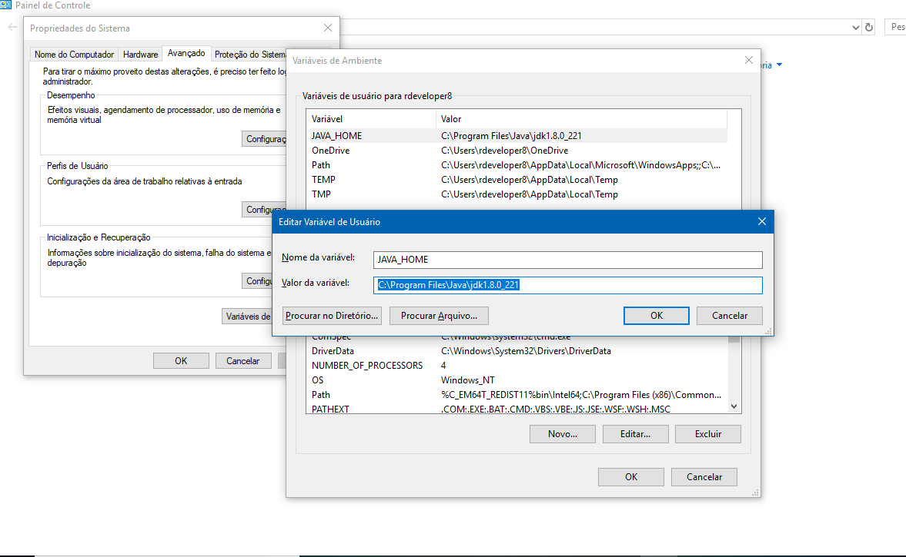

com o JAVA_HOME adcionado, insira-o no Path apontando o diretório da pasta bin:

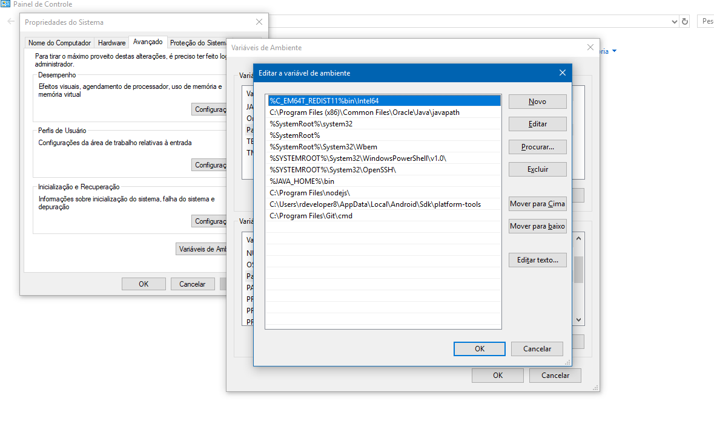


## Configuração Linux

Utilizando o Linux Mint, baseada em Ubuntu para poder instalar o Java 8, primeiramente baixe o [JAVA](https://www.oracle.com/br/java/) (Neste tutorial utilizamos o JAVA 8), em seguida configure sua variável de ambiente JAVA_HOME e o PATH no diretório do .bashrc:

(Neste exemplo o arquivo java está no diretório usr/lib/jvm/java-11-openjdk-amd64)

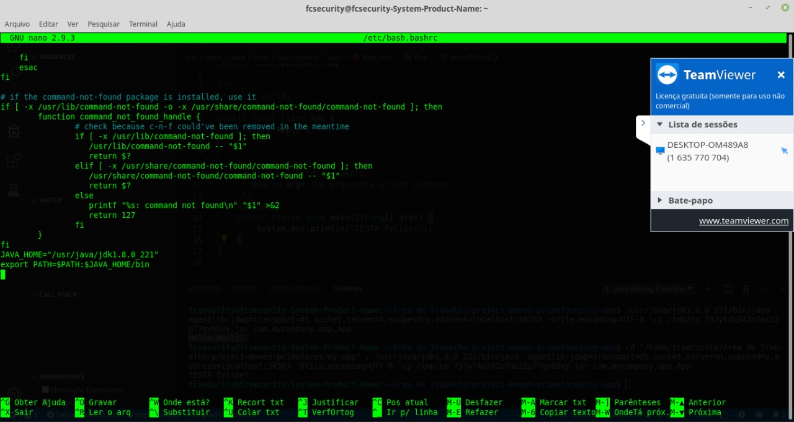

## Criar projeto 

**Agora sim**. Com o sistema operacional configurado com o Java vamos criar nosso projeto utilizando a IDE Eclipse EE.

### Eclipse

Primeiramente você precisa baixar o [Eclipse EE](https://www.eclipse.org/mars/) de acordo com o seu sistema operacional e instale na sua máquina.

Agora configure o [TomCat 7](http://tomcat.apache.org/) no eclipse: Vá em **new** e **Server**: 

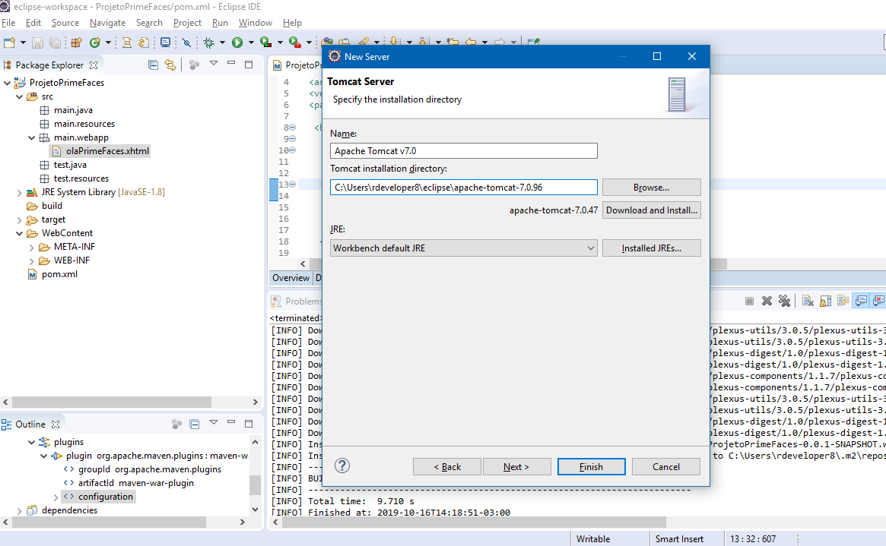


Selecione o diretório aonde você armazenou o TomCat:

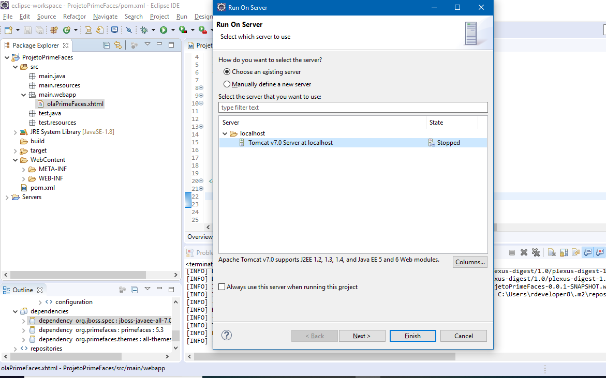

Finalize a Configuração apertando em Finish.

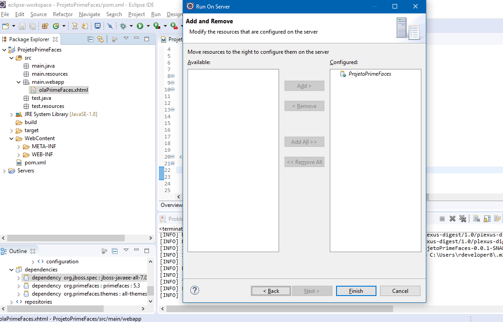

Feito isso, crie um novo projeto Maven, vá para aba **File** ou **Alt+Shift+N**, e crie um **Maven Project** .

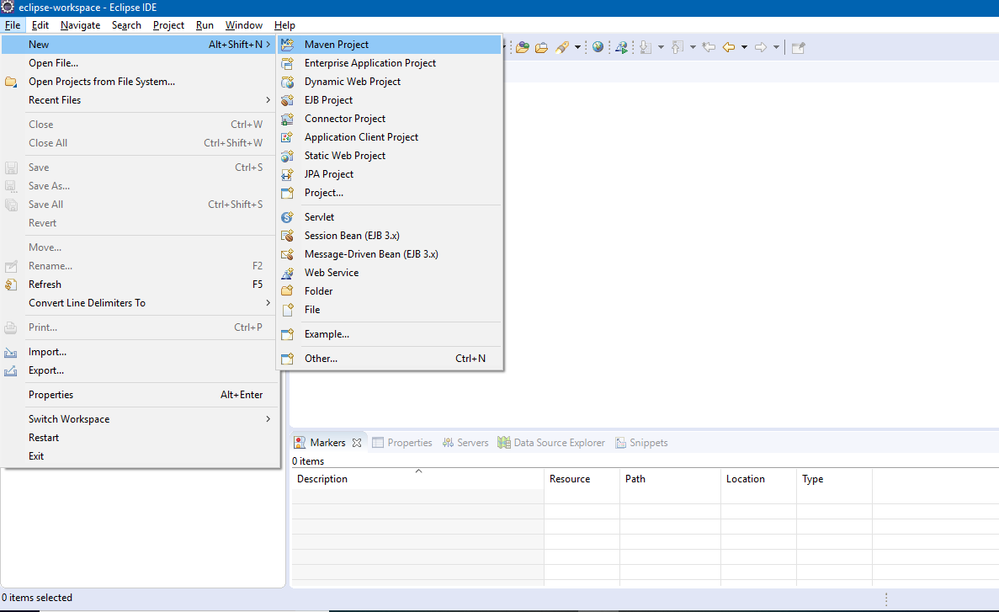

Na janela seguinte selecione as seguintes opções: **Create a simple project(Skip archetype selec)** e **Use default workspace location**.

**Obs:** caso queira armazenar o projeto em um outro diretório, basta adicionar um novo acessando a opção **browse**.

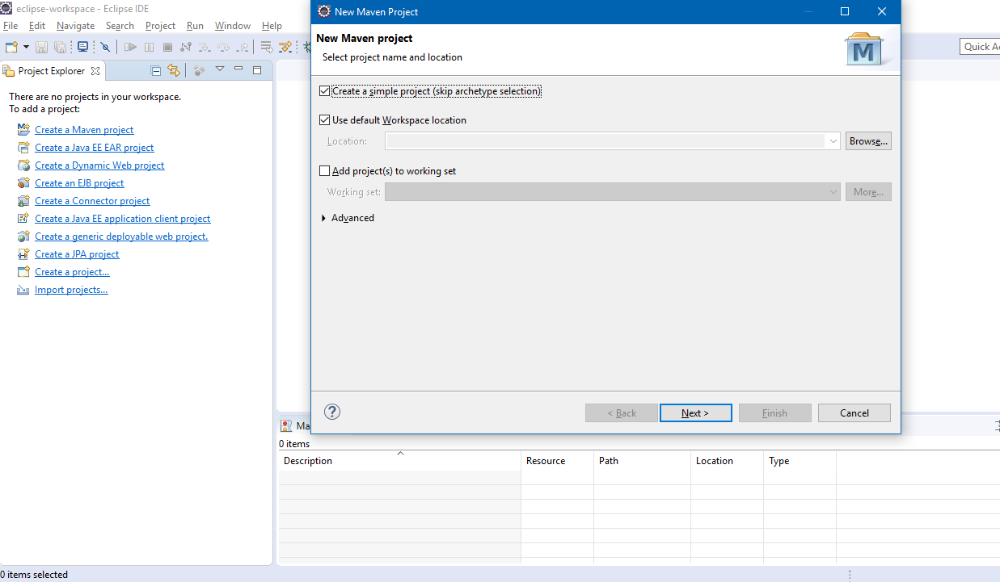

Clique em **Next**, na próxima janela e preencha os dados do projeto Maven:

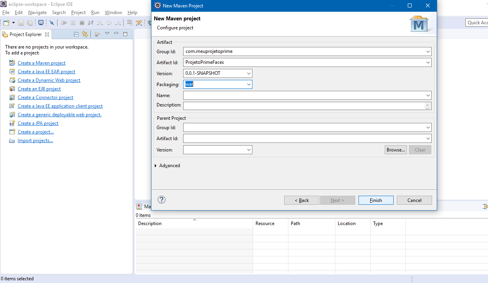

Finalizado a inserção dos dados clique em **Finish**.

Pronto, o projeto foi criado, agora precisamos fazer algumas configurações.

Primeiramente clique com o botão direito do mouse em cima do projeto e em seguida clique em **Properties**.

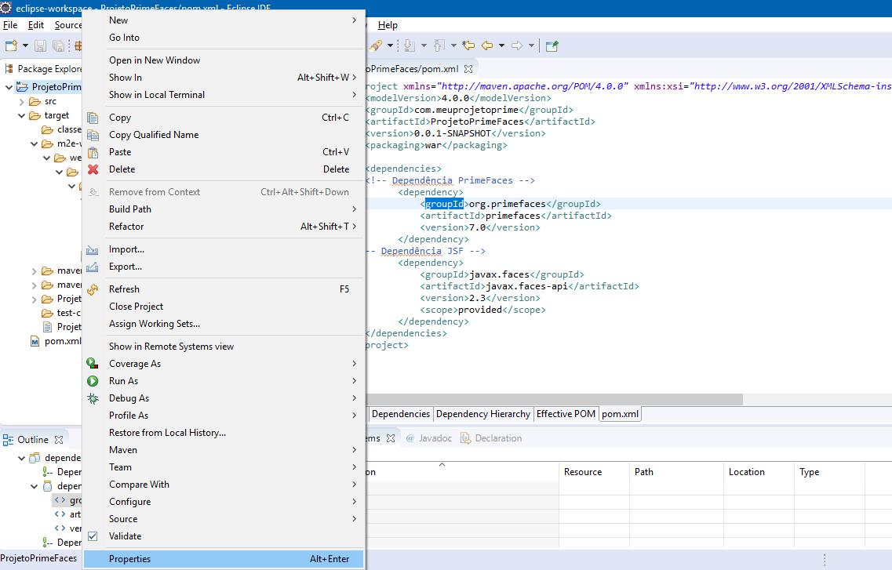

Configure o JavaServer Faces clicando em  **Project Facets** e habilite os campos **Dynamic Web Module**, **Java**, **JavaScript** e **JavaServer Faces**.

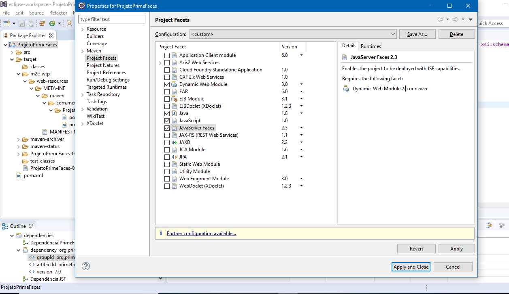

Configurado , finalize as configurações clicando  em **Apply** em seguida em **Ok**.

Pronto, o projeto web esta configurando no eclipse.

Agora vamos inserir as dependências necessárias do projeto maven no arquivo **pom.xml**. Vamos precisar das dependências do JSF e do Primefaces.

Dependência JSF:

```xml
<dependency>
      <groupId>com.sun.faces</groupId>
      <artifactId>jsf-api</artifactId>
      <version>${jsf.version}</version>
      <scope>compile</scope>
    </dependency>
```

Dependência PrimeFaces:

```xml
<dependency>
      <groupId>org.primefaces</groupId>
      <artifactId>primefaces</artifactId>
      <version>${primefaces.version}</version>
</dependency>
```

Segue abaixo como o arquivo deve ficar o arquivo **pom.xml**.

```xml
<project xmlns="http://maven.apache.org/POM/4.0.0" xmlns:xsi="http://www.w3.org/2001/XMLSchema-instance" xsi:schemaLocation="http://maven.apache.org/POM/4.0.0 http://maven.apache.org/xsd/maven-4.0.0.xsd">
  <modelVersion>4.0.0</modelVersion>
  <groupId>com.rdiproject</groupId>
  <artifactId>RdiProject</artifactId>
  <version>0.0.1-SNAPSHOT</version>
  <packaging>war</packaging>


<properties>
    <project.build.sourceEncoding>UTF-8</project.build.sourceEncoding>
    <java.version>1.8</java.version>

    <servlet.version>3.1.0</servlet.version>
    <jsf.version>2.2.15</jsf.version>
    <primefaces.version>6.1</primefaces.version>

    <maven-compiler-plugin.version>3.7.0</maven-compiler-plugin.version>
    <jetty-maven-plugin.version>9.4.8.v20171121</jetty-maven-plugin.version>
  </properties>

  <dependencies>
    <!-- Servlet -->
    <dependency>
      <groupId>javax.servlet</groupId>
      <artifactId>javax.servlet-api</artifactId>
      <version>${servlet.version}</version>
      <scope>provided</scope>
    </dependency>
    <!-- JSF -->
    <dependency>
      <groupId>com.sun.faces</groupId>
      <artifactId>jsf-api</artifactId>
      <version>${jsf.version}</version>
      <scope>compile</scope>
    </dependency>
    <dependency>
      <groupId>com.sun.faces</groupId>
      <artifactId>jsf-impl</artifactId>
      <version>${jsf.version}</version>
      <scope>compile</scope>
    </dependency>
    <!-- PrimeFaces -->
    <dependency>
      <groupId>org.primefaces</groupId>
      <artifactId>primefaces</artifactId>
      <version>${primefaces.version}</version>
    </dependency>
  </dependencies>

  <build>
    <plugins>
      <plugin>
        <groupId>org.apache.maven.plugins</groupId>
        <artifactId>maven-compiler-plugin</artifactId>
        <version>${maven-compiler-plugin.version}</version>
        <configuration>
          <source>${java.version}</source>
          <target>${java.version}</target>
        </configuration>
      </plugin>
      <plugin>
        <!-- jetty-maven-plugin -->
        <groupId>org.eclipse.jetty</groupId>
        <artifactId>jetty-maven-plugin</artifactId>
        <version>${jetty-maven-plugin.version}</version>
        <configuration>
          <httpConnector>
            <port>9090</port>
          </httpConnector>
          <webApp>
            <contextPath>/codenotfound</contextPath>
          </webApp>
        </configuration>
      </plugin>
    </plugins>
  </build>
</project>
```

Com o pom.xml configurado, vamos agora alterar o web.xml para inserir algumas configurações relacionadas ao JSF.

Vamos configurar o Faces Servlet e definir o theme a ser utilizado pelo PrimeFaces, segue abaixo como ficará o nosso web.xml

```xml
<?xml version="1.0" encoding="UTF-8"?>
<web-app xmlns:xsi="http://www.w3.org/2001/XMLSchema-instance" xmlns="http://java.sun.com/xml/ns/javaee" xsi:schemaLocation="http://java.sun.com/xml/ns/javaee http://java.sun.com/xml/ns/javaee/web-app_2_5.xsd" version="2.5">
  <display-name>RdiProject</display-name>

   <!-- Define the JSF servlet (manages the request processing life cycle for JavaServer Faces) -->
  <servlet>
    <servlet-name>faces-servlet</servlet-name>
    <servlet-class>javax.faces.webapp.FacesServlet</servlet-class>
    <load-on-startup>1</load-on-startup>
  </servlet>

  <!-- Map following files to the JSF servlet -->
  <servlet-mapping>
    <servlet-name>faces-servlet</servlet-name>
    <url-pattern>*.xhtml</url-pattern>
  </servlet-mapping>
</web-app>


```

Pronto, fizemos todas as configurações necessárias para rodar nosso projeto JSF, vamos criar uma página utilizando o PrimeFaces e testar o nosso projeto.

Vamos criar uma página xhtml no diretório webapp, vamos nomeá-la de olaPrimeFaces.xhtml e inserir o seguinte conteúdo:

```xhtml

<?xml version="1.0" encoding="UTF-8"?>
<!DOCTYPE html PUBLIC "-//W3C//DTD XHTML 1.0 Transitional//EN" "http://www.w3.org/TR/xhtml1/DTD/xhtml1-transitional.dtd">
<html xmlns="http://www.w3.org/1999/xhtml"
  xmlns:h="http://java.sun.com/jsf/html"
  xmlns:p="http://primefaces.org/ui">

<h:head>
  <title>Projeto PrimeFaces</title>
</h:head>

<h:body>
  <h:form>

    <p:panel header="Formulário de Exemplo PrimeFace">
      <h:panelGrid columns="2" cellpadding="4">
        <h:outputText value="First Name: " />
        <p:inputText value="#{InsiraUmaVariavel}" />

        <h:outputText value="Last Name: " />
        <p:inputText value="#{InsiraUmaVariavel}" />

        <p:commandButton value="Submit" update="greeting"
          oncomplete="PF('greetingDialog').show()" />
      </h:panelGrid>
    </p:panel>

    <p:dialog header="Greeting" widgetVar="greetingDialog"
      modal="true" resizable="false">
      <h:panelGrid id="greeting" columns="1" cellpadding="4">
        <h:outputText value="#{helloWorld.showGreeting()}" />
      </h:panelGrid>
    </p:dialog>

  </h:form>
</h:body>
</html> 


```
Pronto já temos nossa página, vamos agora  execute os Comandos **Maven Clean** e **Maven Install** respectivamente.

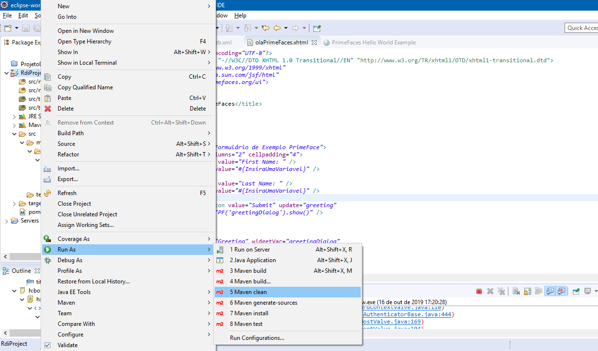

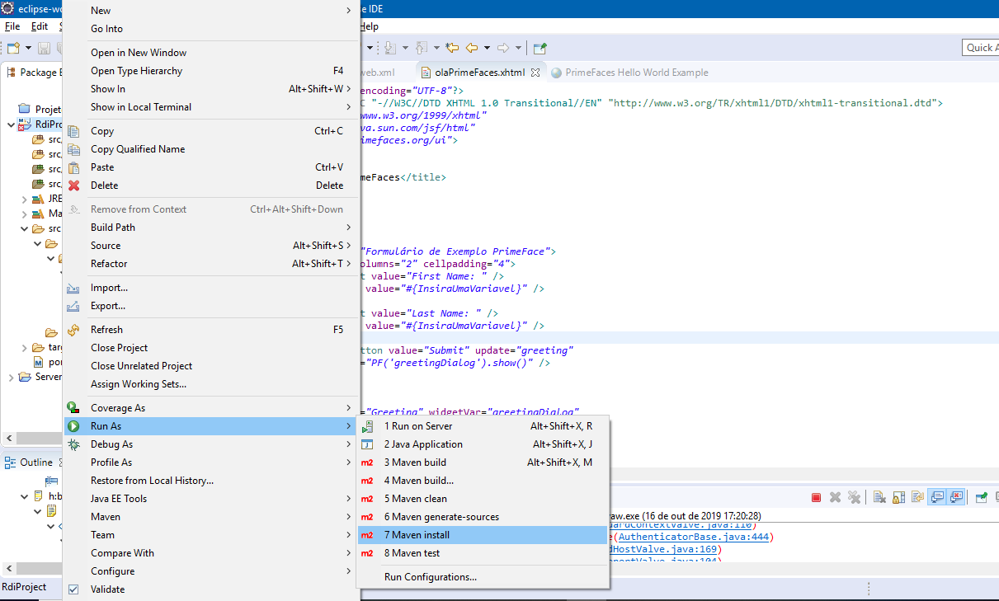

Após ter feito isso, execute o Arquivo olaPrimeFaces.xhtml

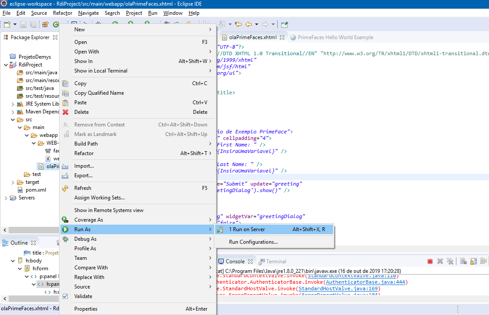

O link gerado neste exemplo foi o http://localhost:8080/RdiProject/olaPrimeFaces.xhtml

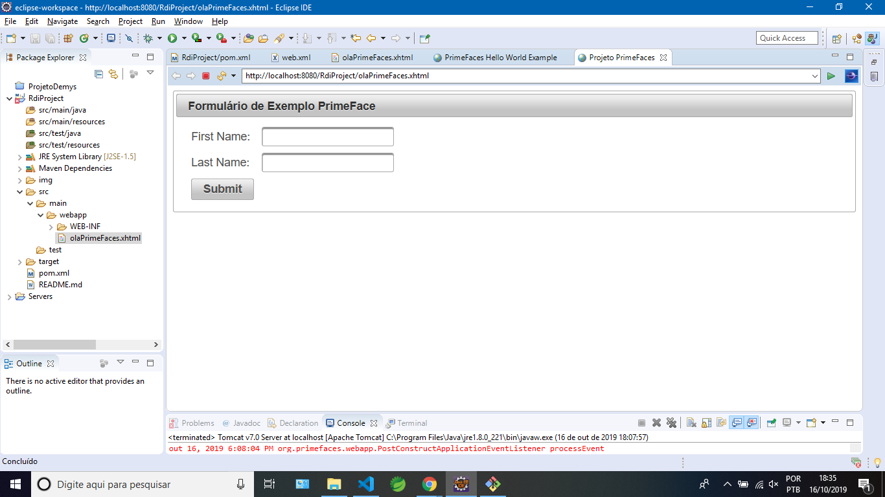

**Obs** caso o nome das pastas do seu projeto seja diferente, o link localhost:8080 permacerá o mesmo apenas com a mudança no nome das pastas.

É isso, as dependências e as configurações do seu projeto estão prontas! Divirta-se :alien:


<!-- * ## Visual Studio Code

<p>Vamos lá, primeiro passo é criar um projeto na sua máquina, 
criamos um projeto chamado projeto-prime dentro da pasta projectRD no diretório.  exemplo: </p><br/>

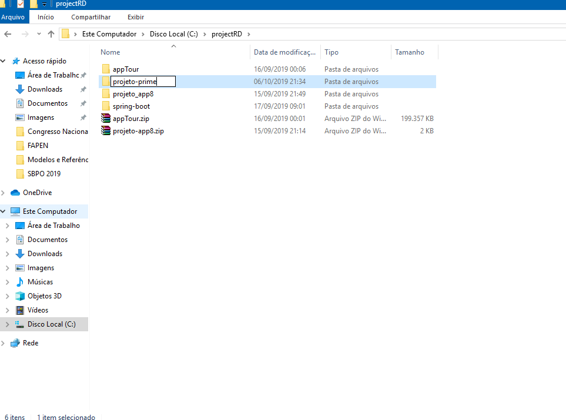

Abra o projeto no Vscode clicando em **File/Open Folder** ou Ctrl + k + O.<br/><hr/>

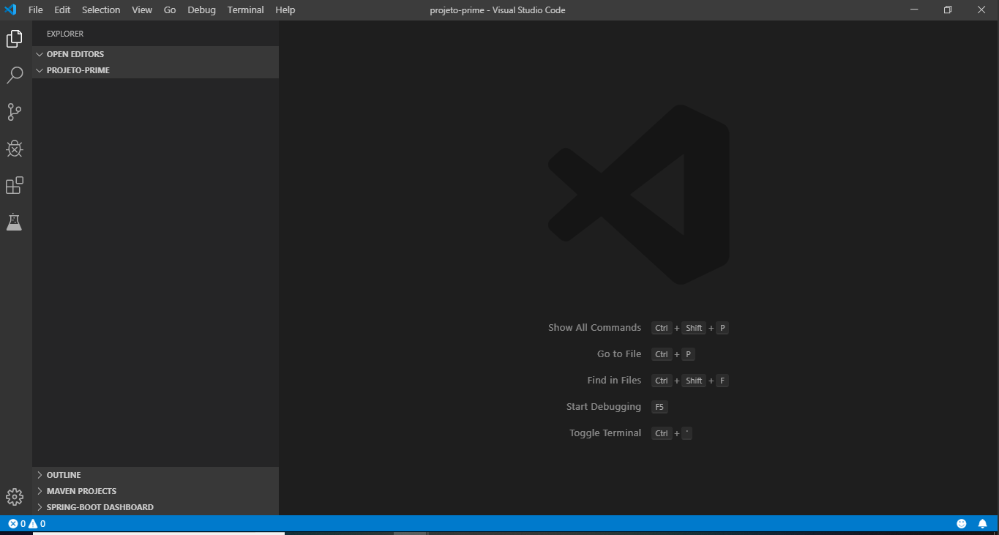


### **Projeto Maven** 

crie um projeto maven **View/Command Palette** ou Ctrl + Shift + P dentro da pasta do projeto criado. <br/>

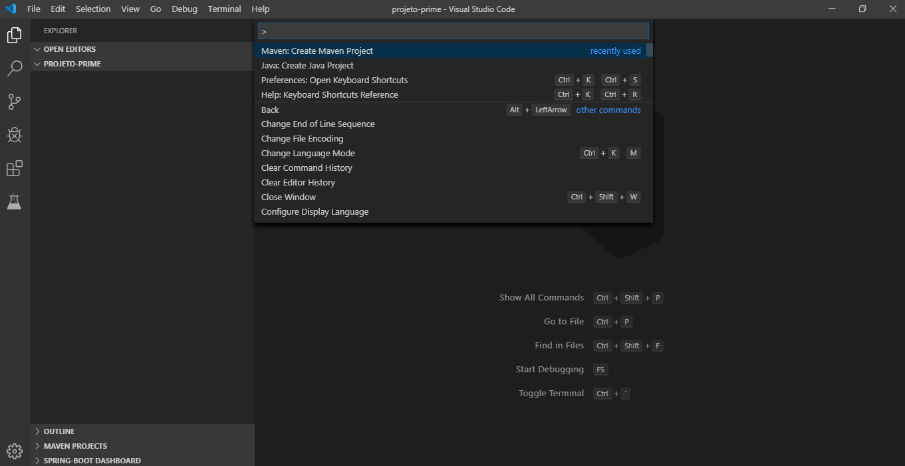 -->

